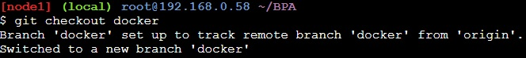
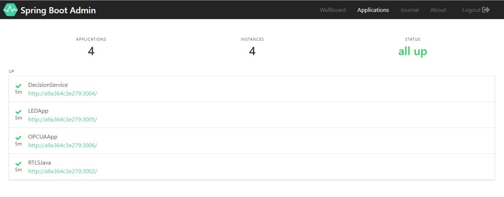

# Klonen des Projektes
Geben Sie anschließend folgenden Befehl ein „git clone https://gitlab.com/ericbrandt91/BPA.git“. Sie werden erneut dem Usernamen und Passwort gefragt um anschließend auf das Repository zugreifen zu können.

Benutzen sie jetzt den Befehl „cd BPA/“ um in das BPA Verzeichnis zu gelangen und anschließend den Befehl „git checkout docker“ um auf den Docker Branch zu wechseln.

# Start des Projektes

Wechseln Sie nun mit dem Befehl „cd iotlabservices“ in das iot Verzeichnis und starten Sie die Dienste mit dem Befehl „docker-compose up“. Dies dauert wenige Minuten und mit einem Klick auf die oben auftauchenden Ports wie Zum Beispiel „50000“ öffnet sich folgendes Fenster.

