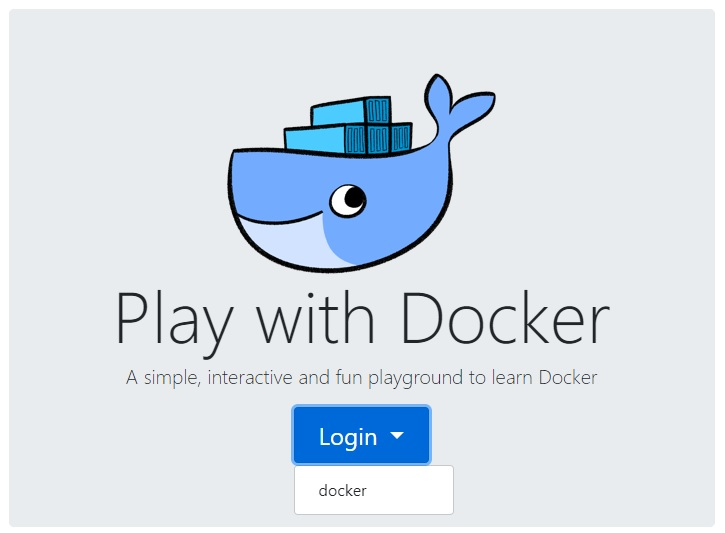
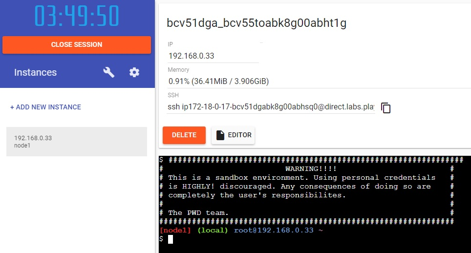

# Play With Docker

Navigieren Sie auf die Seite:

* https://labs.play-with-docker.com

Klicken sie auf „Login“ und wählen „docker“ aus. In dem darauf sich öffnenden Anmeldefenster könne sie sich mit einem bereits bestehenden Account anmelden oder einen neuen Account registrieren. Anschließend können sie mit einem weiteren Klick auf „Start“ direkt loslegen.

# Create Session
In der folgenden Oberfläche, die sich geöffnet hat, müssen Sie auf „ADD NEW INSTANCE“ klicken um starten zu können. Folgendes Oberfläche sollte jetzt erscheinen.

