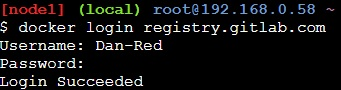

# Login auf Gitlab
Die Docker images der Gruppe UC1 liegen auf Gitlab und werden von da aus an den Kunden geliefert. 

Zunächst fangen sie mit der Docker Anmeldung und dem folgenden Befehl „docker login registry.gitlab.com“ an. Anschließend wird die Eingabe des Usernamens und des Passworts gefordert.

